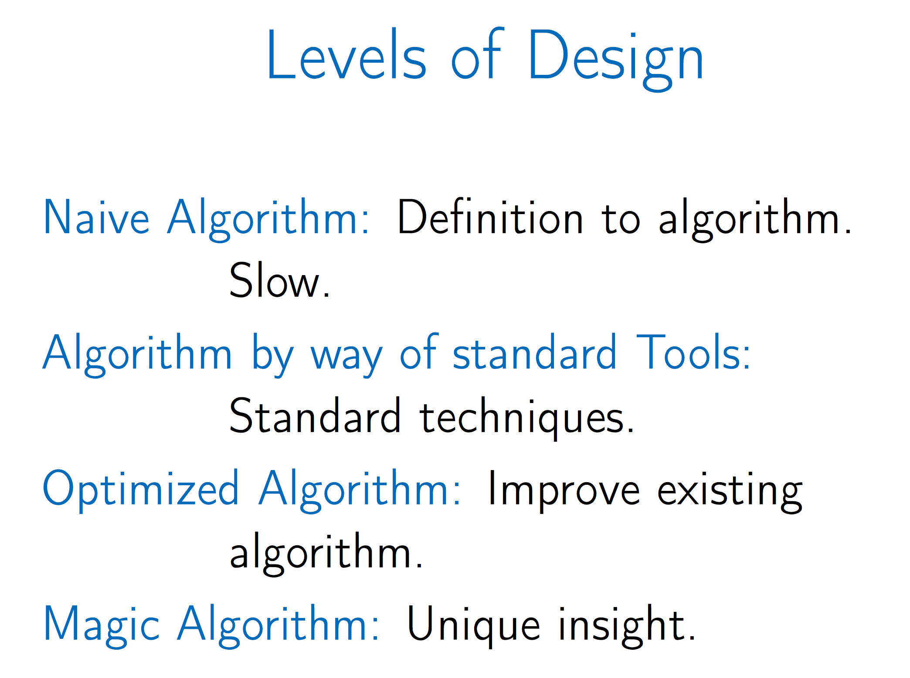

## algorithms
Some very useful algorithms of programming.

#### Mathematics for algorithms

* Primes
    - [Is Prime ?](handy/src/IsPrime.java) : `O(srqrt(n))`
    - [All Primes 1 to n](handy/src/AllPrime.java): [Sieve's algorithm](https://en.wikipedia.org/wiki/Sieve_of_Eratosthenes), `O(n log log n)`

* [GCD: Greatest Common Divisor](handy/src/GCD.java), [Euclid’s algorithm](https://en.wikipedia.org/wiki/Euclidean_algorithm#Algorithmic_efficiency) , `O(log min(a, b))`
* [LCM: Lowest Common Multiple](handy/src/LCM.java),  `O(log min(a, b))`

---

