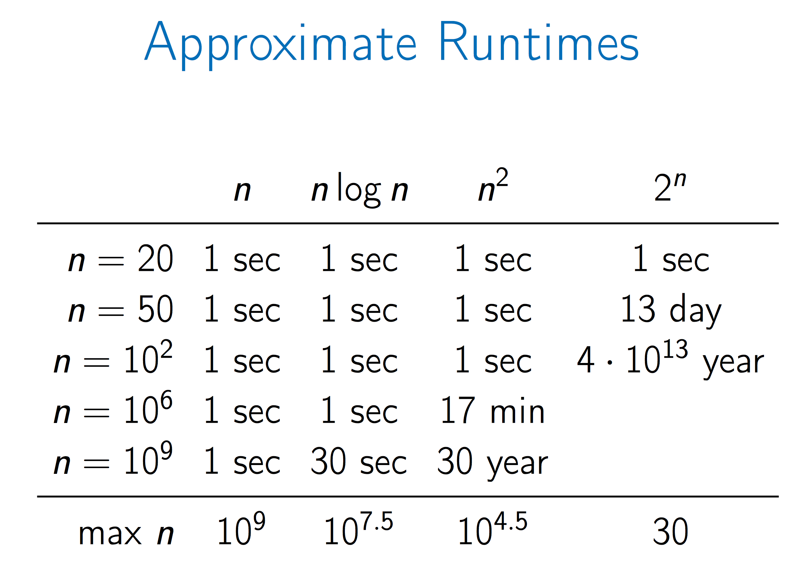
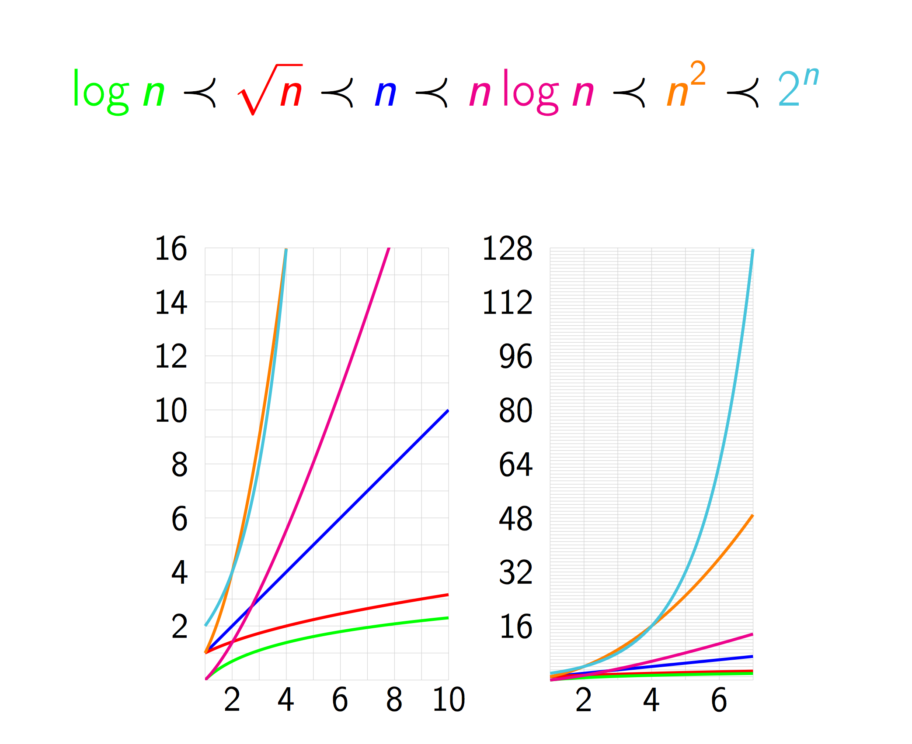
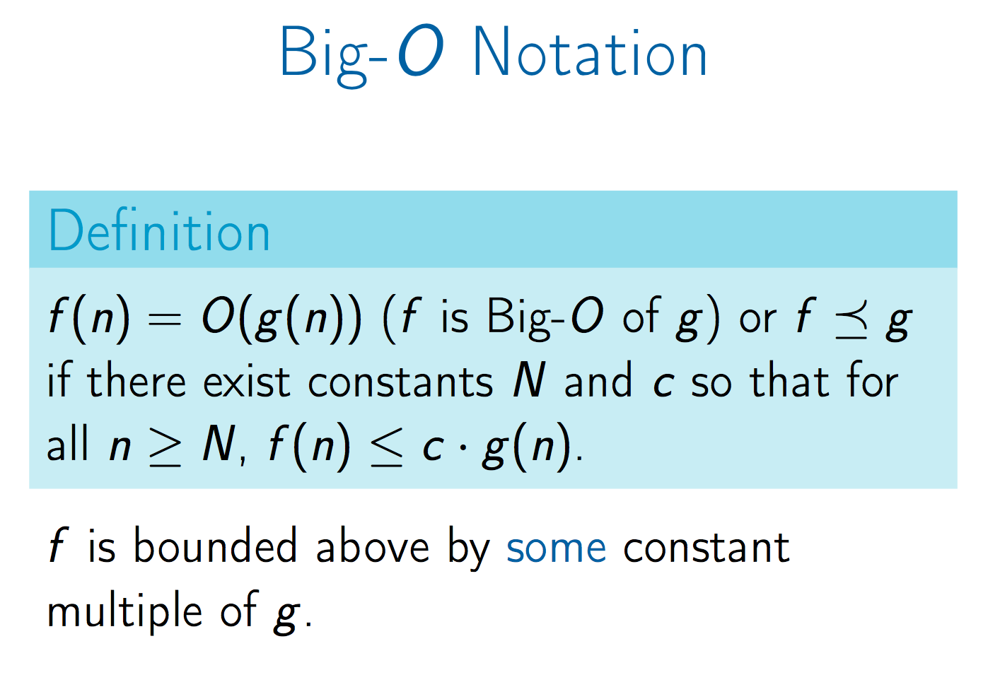
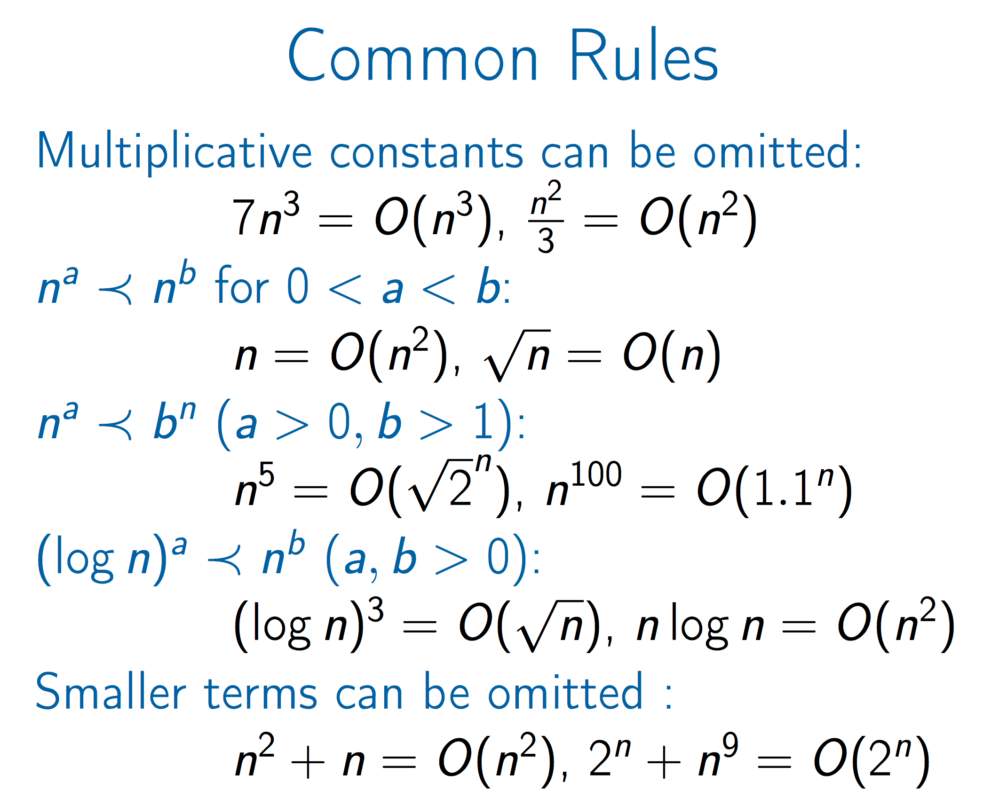
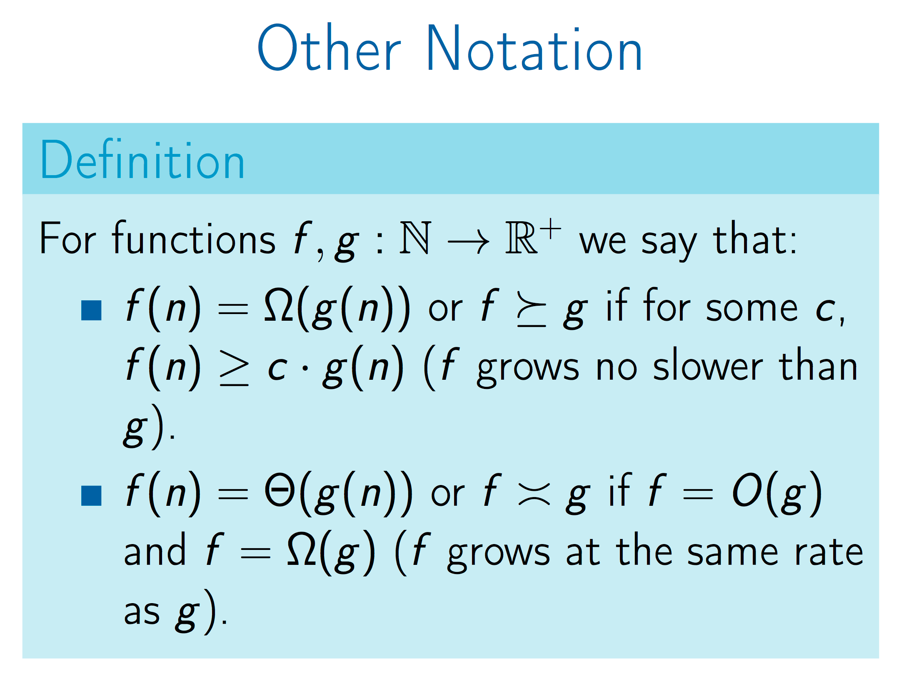
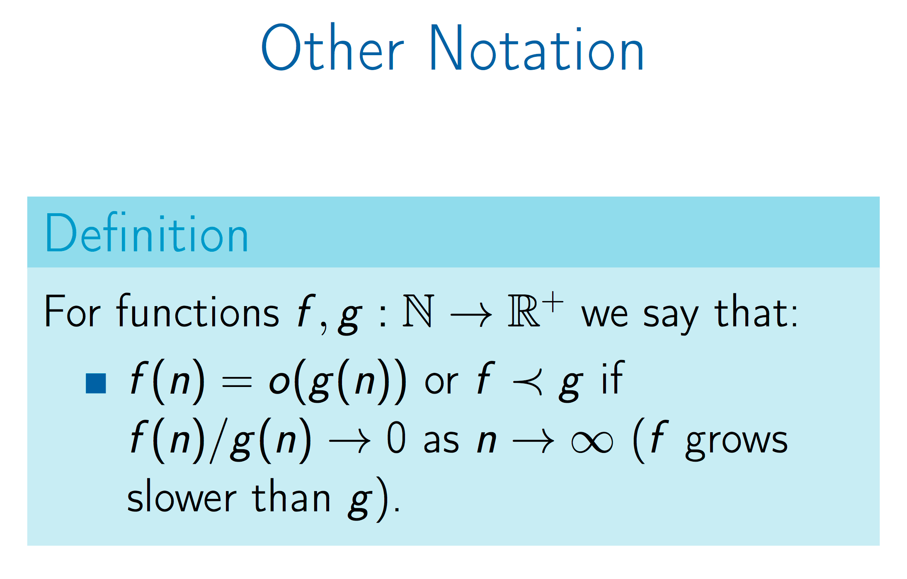
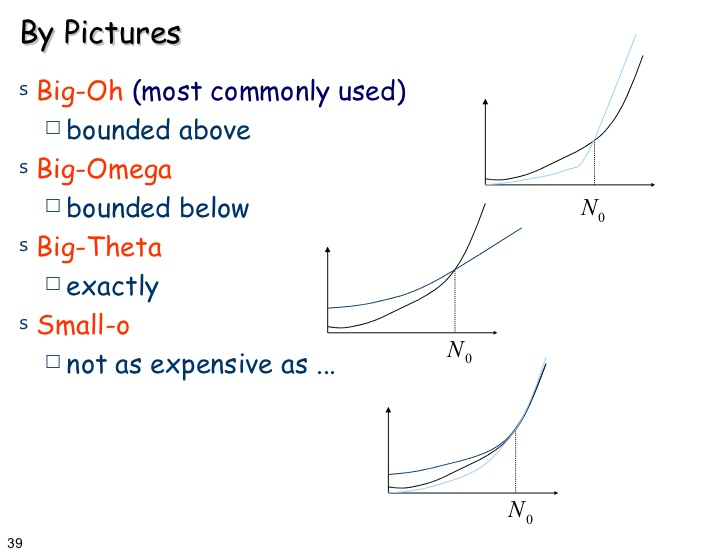
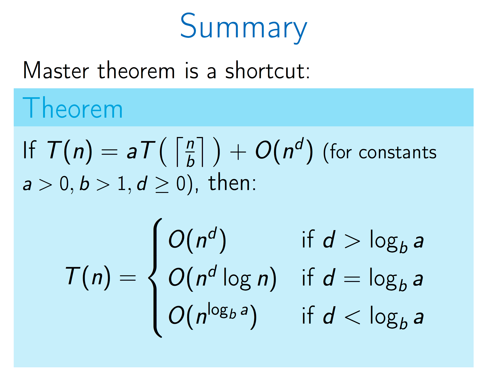

## Run Time: Examples

## Run Time: Comparisons

## Asymptotic Notation: Big O

## Asymptotic Notation: Big O, Examples

## Asymptotic Notation: Big Omega & Big Theta

## Asymptotic Notation: Small O

## Asymptotic Notation: Comparisons

## Master Theory

