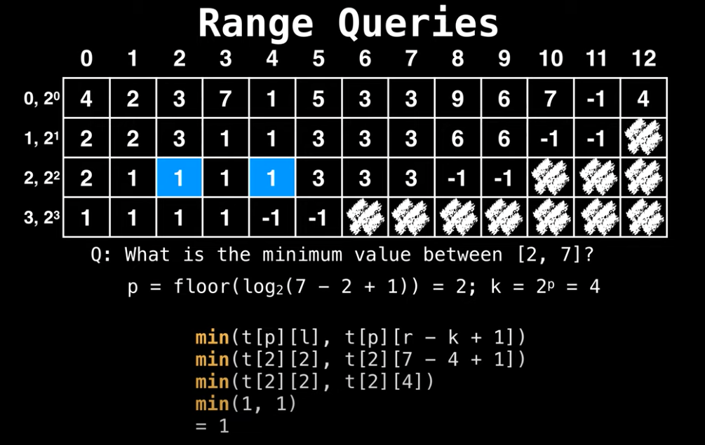
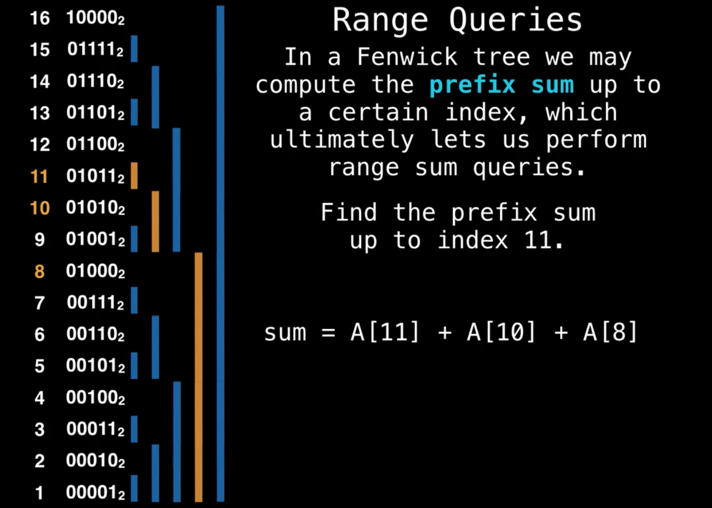

# Range Queries

| RMQ | Sparse Table | Fenwick Tree <br> Binary Indexed Tree | Segment Tree |
|-|-|-|-|

- [Range Queries](#range-queries)
  - [Preview](#preview)
  - [Prefix Sum Array (RSQ)](#prefix-sum-array-rsq)
    - [Implementation](#implementation)
  - [Sparse Table Algorithm](#sparse-table-algorithm)
    - [Ref](#ref)
    - [Implementation](#implementation-1)
      - [RMQ](#rmq)
      - [RSQ](#rsq)
  - [Binary Indexed Tree (Fenwick Tree)](#binary-indexed-tree-fenwick-tree)
    - [ref](#ref-1)
    - [Implementation](#implementation-2)
      - [Range Query & Point Update](#range-query--point-update)
  - [Segment Trees](#segment-trees)
  - [ref](#ref-2)
    - [Implementation](#implementation-3)

## Preview

Goal
- Efficiently processing (logarithmic time) **range queries on arrays**.
  - ex: range sum queries (RSQ) and range minimun queries (RMQ)

Points
- Array values are not modified between queries
  - preprocess array -> any possible query
    - **Prefix Sum Array** for RSQ. Can be generalized to higher dimension.
    - **Sparse Table** for RMQ. Can be maximum query too.
- Process queries and update array values efficiently
  - **Binary Indexed Tree** (Fenwick Tree) for sum queries: dynamic version of of **Prefix Sum Array**.
  - **Segment Tree** supports RSQ, RMQ and several other queries

## Prefix Sum Array (RSQ)

Point
- Each value in array: `k = sum(0, k)`
- `sum(a, b) = sum(0, b)-sum(0, a-1)`
- Constructed: `O(n)`
- Query: `O(1)`
- High Dimension (2D):
  - `S(lower right) - S(lower left) - S(upper right) + S(upper left)`

### Implementation

```cpp
template <class T>
struct PrefixSumArray {
    vector<T> pre;

    PrefixSumArray(int n) { init(n); }

    void init(int n) { pre.resize(n); }

    void set(int idx, T val) { pre[idx] = val; }

    void build() {
        for (int i = 1; i < pre.size(); i++) {
            pre[i] = pre[i - 1] + pre[i];
        }
    }

    T query(int l, int r) { return pre[r] - pre[l - 1]; }
};

int main() {
    // prepare
    PrefixSumArray<int> psa(10);
    for (int i = 0; i < 10; i++) {
        psa.set(i, i);
    }
    printv(psa.pre);
    psa.build();
    printv(psa.pre);

    // query
    cout << psa.query(0, 9) << endl;
    cout << psa.query(5, 9) << endl;
    cout << psa.query(5, 8) << endl;

    return 0;
}
```

## Sparse Table Algorithm

Pros
- RMQ: `O(1)`
- Other queries: `O(log n)`
  - ex: sum, gcd, multply etc ...

Cons
- Immutable array

How
- Precalculate all values of `min(a, b)`
  - Preprocess: `O(n log n)`

Idea
- Any non-negative number can be uniquely represented as sum of decreasint power of two.
  - Like binary representation of a number.
  - ex: `13 = (1101) = 8 + 4 + 1`, `log(13) = 3` summands.
- Same reasoning, any interval can be uniquely represented union of intervals with lenghts that are decreasing powers of two.
  - ex: `[2, 14] = [2, 9] + [10, 13] + [14, 14]`
  - ex: (RMQ) Split 2 overlapping range: `[1, 6] = [1, 4] + [3, 6]`




### Ref
- https://cp-algorithms.com/data_structures/sparse-table.html
- https://www.youtube.com/watch?v=uUatD9AudXo&ab_channel=WilliamFiset

### Implementation

#### RMQ

```cpp
#include <bits/stdc++.h>

using namespace std;

template <class T>
struct SparseTableRMQ {
    vector<vector<T>> st;
    vector<int> l2;
    int N;
    int K;

    // construct: O(n log n)
    SparseTableRMQ(vector<T> v) {
        N = v.size();
        K = floor(log2(N));

        st.resize(N, vector<T>(K + 1));
        for (int i = 0; i < N; i++) st[i][0] = v[i];
        for (int j = 1; j <= K; j++)
            for (int i = 0; i + (1 << j) <= N; i++)
                // min
                st[i][j] = min(st[i][j - 1], st[i + (1 << (j - 1))][j - 1]);

        l2.resize(N + 1);
        l2[1] = 0;
        for (int i = 2; i <= N; i++) l2[i] = l2[i / 2] + 1;
    }

    // query: O(1)
    T query(int L, int R) {
        int j = l2[R - L + 1];
        return min(st[L][j], st[R - (1 << j) + 1][j]);
    }
};

int main() {
    vector<int> a = {7, 2, 3, 0, 5, 10, 3, 12, 18};
    SparseTableRMQ<int> rmq(a);
    cout << rmq.query(0, 4) << endl;
    cout << rmq.query(4, 7) << endl;
    cout << rmq.query(7, 8) << endl;

    return 0;
}
```

#### RSQ

```cpp
#include <bits/stdc++.h>

using namespace std;

template <class T>
struct SparseTableRSQ {
    vector<vector<T>> st;
    int N;
    int K;

    // construct: O(n log n)
    SparseTableRSQ(vector<T> v) {
        N = v.size();
        K = floor(log2(N));

        st.resize(N, vector<T>(K + 1));
        for (int i = 0; i < N; i++) st[i][0] = v[i];
        for (int j = 1; j <= K; j++)
            for (int i = 0; i + (1 << j) <= N; i++)
                // sum
                st[i][j] = st[i][j - 1] + st[i + (1 << (j - 1))][j - 1];
    }

    // query: O(log n)
    T query(int L, int R) {
        T sum = 0;
        for (int j = K; j >= 0; j--) {
            if ((1 << j) <= R - L + 1) {
                sum += st[L][j];
                L += 1 << j;
            }
        }
        return sum;
    }
};

int main() {
    vector<int> a = {7, 2, 3, 0, 5, 10, 3, 12, 18};
    SparseTableRSQ<int> rsq(a);
    cout << rsq.query(0, 4) << endl;
    cout << rsq.query(4, 7) << endl;
    cout << rsq.query(7, 8) << endl;

    return 0;
}
```

## Binary Indexed Tree (Fenwick Tree)

Pros
- Range Queries & Updating values in static array, efficiently.
  - Construction: `O(n)`
  - Point Update: `O(log n)`
  - Range Update: `O(log n)`
  - Rage Sum: `O(log n)`
- Supports
  1. Range Query & Point Update
  1. Point Query & Range Update
  1. Range Query & Range Update

Idea
- Each cells in Fenwick Tree is responsible for `power of 2` belowing elements.
  - Calculating Power: `pos(LSB) - 1`. (Least Significant Bit)
    - ex: `8 = (01000)` -> `pos(LSB) = 4`. Means 8th element is responsible for `2^(4-1) = 8` elements.
- Range Query: Cascade downwards through array
  - ex: sum `[11, 15]` = `[1, 15] - [1, 11)`
    - `[1, 15] = FT[15] + FT[14] + FT[12] + FT[8]`
    - `[1, 11) = FT[10] + FT[8]`
    - sum `[11, 15]` = `(FT[15] + FT[14] + FT[12] + FT[8]) - (FT[10] + FT[8])`



### ref

- https://www.youtube.com/watch?v=RgITNht_f4Q&ab_channel=WilliamFiset
- https://cp-algorithms.com/data_structures/fenwick.html

### Implementation

#### Range Query & Point Update

```cpp
#include <bits/stdc++.h>

using namespace std;

template <class T>
struct FenwickTreeRQPU {
    vector<int> bit;  // binary indexed tree
    int n;

    FenwickTreeRQPU(int n) {
        this->n = n + 1;
        bit.assign(n + 1, 0);  // one base indexing
    }

    FenwickTreeRQPU(vector<int> a) : FenwickTreeRQPU(a.size()) {
        for (size_t i = 0; i < a.size(); i++) add(i, a[i]);
    }

    T sum(int idx) {
        int ret = 0;
        for (++idx; idx > 0; idx -= idx & -idx) ret += bit[idx];
        return ret;
    }

    // RQ: Range Query
    T sum(int l, int r) { return sum(r) - sum(l - 1); }

    // PU: Point Update
    void add(int idx, T delta) {
        for (++idx; idx < n; idx += idx & -idx) bit[idx] += delta;
    }
};

int main() {
    vector<int> a = {7, 2, 3, 0, 5, 10, 3, 12, 18};
    FenwickTreeRQPU<int> bit(a);
    cout << bit.sum(0, 4) << endl;
    cout << bit.sum(4, 7) << endl;
    cout << bit.sum(7, 8) << endl;

    bit.add(7, 1);
    cout << bit.sum(4, 7) << endl;
    cout << bit.sum(7, 8) << endl;

    return 0;
}
```

## Segment Trees

Pros
- Range Query & Updating an array value in `O(log n)`
- Supports
  - Any range queries where we can divide a range into two parts.
    - ex: Min/Max, Sum, gcd, bit operations AND, OR and XOR
Idea
  - Each internal tree node corresponds to an array range whose size is power of two.
    - ex: RSQ, each internal node sum of left and right node.
  - Any range `[a, b]` divided into `O(log n)` subranges whose values are stored in tree nodes.

## ref

- https://cp-algorithms.com/data_structures/segment_tree.html

### Implementation

- array: `1 base indexed`
- root at index `1`
  - left : `2i`
  - right: `2i + 1`

```cpp

```
